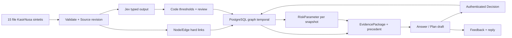

# 03 — ARCHITECTURE & Rencana Build: Tessera untuk KasirNusa

> Turunan `01-PRD.md` dan `09-BUILD-PLAN-KASIRNUSA.md`. Nama produk aktif Tessera (`08-DESIGN.md`); judul Relasi pada dokumen historis belum semuanya diselaraskan. Next.js dipilih; PostgreSQL untuk demo publik diterima dalam ADR-0001. ADR-0002, [ADR-0003](adr/0003-backend-contract-t1-t5.md), dan [ADR-0004](adr/0004-minimal-backend-tooling-and-access.md) masih Proposed. Belum ada scaffold, provider hosting, library DB, atau identitas demo yang dipilih. §8–§12 adalah kontrak usulan untuk review T1–T5, bukan keputusan produk final.

## 1. Stack dan batas keputusan

| Lapisan | Keputusan / usulan | Catatan |
|---|---|---|
| Web | Next.js App Router, TypeScript strict [Next.js dipilih; TypeScript usulan] | Server lebih dulu; UI ikuti `08-DESIGN.md` |
| Data | PostgreSQL untuk demo publik (ADR-0001) | Graph melalui tabel node/edge/provenance dan query SQL; library koneksi/migrasi belum dipilih |
| AI klasifikasi | Jev/TypeSafe | Sinyal teks ambigu saat ingest; output bertipe, ambang dan keputusan di kode |
| AI generatif | Satu provider yang disetujui tim | Penjelasan, skenario berasumsi, dan draf tindakan; tidak menghitung skor/approve |
| UI | Tailwind v4 dan visual graph kecil [usulan] | Token resmi di `08-DESIGN.md`; dependency baru memerlukan izin |
| Hosting/auth | Belum dipilih | Demo publik membaca data berizin; ingest, feedback, dan approval butuh identitas dan otorisasi; rate limit |

Arsip `dataset_kasirnusa.zip` dan hasil ekstrak `dataset_kasirnusa/` diabaikan Git. README menyebut 15 file data sintetis, 40 pelanggan + 5 prospek, histori operasional 1 Okt 2025–30 Sep 2026, snapshot 1 Okt 2026. Peta kolom, cakupan terukur, rumus parameter, dan keterbatasan terdapat di `10-DATA-PROFILE-KASIRNUSA.md`. Jangan commit dataset penuh, secret, atau cache berisi data pelanggan.

## 2. Perintah verifikasi setelah scaffold

| Cek | Perintah |
|---|---|
| Dev | `pnpm dev` |
| Test | `pnpm test` |
| Build | `pnpm build` |
| Typecheck | `pnpm typecheck` |
| Lint | `pnpm lint` |
| Dead code | `pnpm exec knip` |
| Golden demo | Jalankan `pnpm dev`, ikuti `01-PRD.md` §5 |
| Benchmark bila retrieval/model berubah | `pnpm exec tsx scripts/benchmark.ts`, simpan output aktual |

Nama script adalah kontrak scaffold, belum tersedia. Jangan klaim cek lulus sebelum dijalankan. UI juga diperiksa di browser 375/768/1440, keyboard, state, dan Standar UI A1–A8. Jika `08-DESIGN.md` berubah, lint design tokens menurut `07-RULES.md`.

## 3. Data dan graph

Enam kelompok sumber berasal dari 15 file data: CRM (`crm_accounts`, `crm_contacts`, riwayat kerja, deals, employees), interaksi JSONL, pemakaian/outlet/fitur, support/bug/rilis, kontrak/billing, dan `decision_log`. Join utama: `account_id`, `contact_id`, `employee_id`, `outlet_id`, `bug_id`, `feature_id`, dan ID interaksi/keputusan. Email historis tidak selalu sama dengan email saat ini; konflik hard ID tidak boleh di-merge otomatis.

Node kandidat: Akun, Outlet, Kontak, Karyawan, Deal, Kontrak, Interaksi, Tiket, Bug, Rilis, Fitur, Keputusan, Kompetitor, Signal, Evidence. Relasi minimal dan contoh C01–C06 dijabarkan di `09-BUILD-PLAN-KASIRNUSA.md`. Setiap fakta/edge menyimpan source ID, waktu, status sintetis, dan bila berasal dari Jev: rubrik, model, kutipan/span, serta `yesProbability` untuk `noul` **atau** `score` dan `confidence` untuk `score`. Hubungan turunan seperti tiket→bug yang tak punya `bug_id` ditandai `derived` dengan alasan dan estimasi terpisah bila benar-benar dihitung; jangan menyamakan dengan hard link atau confidence Jev.

Tabel konseptual: `sources`, `nodes`, `edges`, `signals`, `jev_runs`, `plans`, `decisions`, `feedback`, `feedback_replies`. Skema final menunggu T1. Fakta temporal menambah versi baru; sumber lama tidak dihapus. Hash + source ID mencegah ingest duplikat. Ingest dan approval memakai transaksi; Decision append-only dan idempotency key unik. Feedback menyimpan actor, waktu, konteks, isi/status; reply tersimpan tanpa mengubah Decision/score secara otomatis.

## 4. Pipeline dan skor

1. Baca CSV/JSONL dari direktori lokal yang diabaikan Git; validasi skema, ID, tanggal, encoding, dan duplikasi. Simpan laporan baris, node, edge, error, serta cakupan per akun.
2. Kompilasi hard link dari ID. Ambiguitas teks kecil (niat pindah, keluhan, urgensi, penyebutan kompetitor) dikirim ke Jev dengan rubrik berversi. Validasi respons; tulis/review/discard lewat ambang kode. Kutipan harus cocok source span.
3. Kode/SQL menghitung perubahan transaksi per hari 90 hari terakhir vs 90 hari sebelumnya, tiket terbuka/umur/kaitan bug, champion/decision-maker, janji dan engagement, serta keterlambatan bayar 12 bulan. Pembacaan dilakukan pada snapshot 1 Okt 2026; faktor menyimpan sumber, periode, nilai, status data, dan alasan bila tak tersedia.
4. Bobot uji pertama: pemakaian 30%, gangguan layanan 25%, relasi champion 20%, janji dan engagement 15%, pembayaran 10%. Kode menghasilkan skor prioritas 0–100 dan level, berversi. Ambang level dan aturan data kosong diputuskan setelah profiling; data kosong tidak menjadi nol. Gangguan sinkronisasi ditandai sebagai masalah layanan/kualitas data agar penurunan transaksi tak dihitung dua kali.
5. Renewal, NPS, dan nilai kontrak ditampilkan sebagai konteks. Jika nilai tertimbang digunakan: `nilai_tahunan × skor_prioritas / 100`; tidak boleh disebut prediksi kerugian. Skor tidak disebut probabilitas churn tanpa outcome historis dan kalibrasi.
6. Traversal graph mengembalikan node/relasi/sumber untuk pertanyaan baru. LLM hanya menerima paket fakta terpilih dengan hitungan kode, sumber, kutipan, asumsi, dan preseden Decision. Validasi angka dan sitasi sebelum ditampilkan; tanpa bukti cukup, abstain. Draf save plan disunting pengguna, lalu persetujuan ditulis sebagai Decision.

## 4b. Peta panggilan AI dan evaluasi

| Titik | Primitif/input ringkas | Control flow kode | Evaluasi |
|---|---|---|---|
| Niat pindah/kompetitor/keluhan | Jev `noul` pada kutipan bersumber | p≥0,85 tulis; 0,50–0,85 review; lainnya abaikan sebagai sinyal aktif | Label contoh KasirNusa, audit false positive/negative |
| Urgensi/berat keluhan | Jev `score` 0–3 dengan rubrik | confidence≥0,80 dan skor≥2 tulis; ambigu review | Rubrik dan sampel berlabel berversi |
| Identitas ambigu | Jev `noul` pasangan entitas + hard identifiers | p≥0,95 dan tanpa konflik ID: merge; 0,60–0,95 review; lainnya pisah | Hard negatives, precision auto-merge |
| Relevansi bukti untuk tanya graph | Jev `score` 0–3 bila perlu | skor≥2 dan confidence≥0,80 masuk konteks | Query dan korpus sama untuk perbandingan |
| Penjelasan/save plan | LLM generatif, paket fakta tersumber | Kode memeriksa angka/sitasi; manusia approve | Audit ketepatan sumber dan abstain |

Ikuti pola API dan respons di `JEV-KIT.md`, rubrik di `JEV-LENS.md`. Semua provider dipanggil server-side; kunci dari environment. Retry terbatas hanya 429/5xx, bukan 401/403. Catat model string persis, versi rubrik/prompt, input hash, token, latensi, error, dan biaya dengan rate aktual. `noul` menghasilkan probabilitas ya **tanpa confidence terpisah**; `score` menghasilkan confidence dan probabilitas per tingkat. Nilai tersebut bukan probabilitas churn dan belum tentu terkalibrasi pada domain ini. Eval primitif minimal 20–50 contoh berlabel per pertanyaan kecil; laporkan ukuran sampel serta kesalahan, tanpa klaim akurasi sebelum run.

Benchmark retrieval, bila dibuat, memakai pertanyaan/korpus/answerer/judge dan budget identik; laporkan biaya query serta ingest/amortisasi terpisah. SalesTranscriptQA boleh menjadi benchmark eksternal terpisah sesuai lisensi, tidak dipakai untuk klaim churn KasirNusa. Pertanyaan live KasirNusa harus dijawab dari graph aktual dan jalur bukti, bukan jawaban hardcode.

## 5. Hak akses, approval, dan feedback

- Read publik hanya untuk data demo yang diizinkan, dengan rate limit. Jangan tampilkan secret atau dataset di log/client bundle.
- Ingest dan approval: pengguna aplikasi terautentikasi (CSM/Account Manager) atau admin. Endpoint memeriksa peran server-side.
- Approval/reject menambah `Decision` dengan actor, waktu, sumber, versi rencana, dan idempotency key. Tidak mengirim email/outreach.
- Feedback: pengguna aplikasi memberi pendapat/usulan pada akun/rencana; CSM/admin menanggapi. Simpan actor, waktu, konteks, isi/status, dan reply. Feedback tidak otomatis mengubah graph fakta, parameter, skor, atau Decision. Jika yang dimaksud pengguna adalah pelanggan akhir, desain akses baru perlu keputusan tersendiri.

## 6. Rencana build dan QA

ID mengikuti `04-TODO.md`. T1 scaffold dan kontrak data; T2 ingest/graph/Jev; T3 skor dan uji C01–C06 + 40 pelanggan; T4 peringkat/detail/tanya graph; T5 save plan/Decision/feedback; T6 demo publik, verifikasi UI dan golden path; T7 pitch/artefak demo serta benchmark aktual bila dibuat. Setiap perubahan mengikuti `07-RULES.md`.

QA kasus wajib dari `09-BUILD-PLAN-KASIRNUSA.md` §6: C03 dan C05 terkait BUG-412/offline, C01 champion pindah + FEAT-07, C04 renewal dekat, dan semua 40 pelanggan masuk peringkat. Jangan memakai dua akun churn historis sebagai backtest: data tidak memuat outcome Closed Lost renewal yang cukup. Hasil uji dan bobot akhir harus dicatat sebelum klaim demo.

## 7. Keputusan tertunda

Provider hosting dan identitas demo; library PostgreSQL dan migrasi; batas biaya; ambang level/aturan data kosong; jenis deliverable 9 Okt 22.00 dan deadline submit resmi; apakah feedback dari pengguna aplikasi atau pelanggan akhir. Jangan mengubah ADR Accepted diam-diam; perubahan pilihan penyimpanan perlu ADR baru.

## 8. Status keputusan dan kontrak lintas tiket (usulan)

| Topik | Status 9 Okt 2026 | Dasar / tindakan |
|---|---|---|
| Scope F1–F6 dan urutan F1→F4 sebelum F5 | **Accepted** | `01-PRD.md`, ACC 9 Okt; KasirNusa sintetis adalah demo utama |
| Next.js dan PostgreSQL untuk demo publik | **Accepted** | Pilihan aplikasi dan ADR-0001; bukan persetujuan library/provider |
| Parameter risiko, batas LLM, feedback, bobot percobaan | **Proposed** | ADR-0002 belum diterima; bobot 30/25/20/15/10 untuk uji, bukan final |
| Payload, temporal snapshot, idempotensi, batas modul | **Proposed** | ADR-0003 dan §8–§11 ini menunggu review T1 |
| `pg`/migrasi SQL, Vitest, Zod, auth, generatif | **Proposed** | ADR-0004; tidak ada izin instalasi/provider dari tiket ini |
| Normalisasi, level, data partial/offline, bobot final | **Open** | Cecep/tim sesudah uji 40 akun; jangan menyimpan `0` sebagai pengganti unknown |
| Hosting, identitas, biaya, izin data untuk publik | **Open** | Harus diputuskan sebelum membuka write/deploy |

Kontrak logis berikut memisahkan identitas bisnis dari ID baris fisik. Semua ID yang tampak keluar API berupa string opaque, kecuali ID eksternal dataset yang selalu disertai namespace/revisi. Waktu adalah ISO-8601 UTC; tanggal dataset tanpa jam diperlakukan sebagai tanggal kalender pada konteks sumber, bukan otomatis tengah malam UTC. `sourceKind`/`origin` membedakan dataset sintetis, input aplikasi, dan turunan; setiap nilai yang berasal dari KasirNusa membawa `synthetic: true`. Field `schemaVersion` mengizinkan perubahan additive tanpa diam-diam mengubah pembaca lama. Semua batas masuk dan keluaran provider divalidasi; schema DB memakai foreign key, unique, check, dan not-null sesuai invariant.

| Objek | Field minimum dan invariant | Pemilik penulis → pembaca |
|---|---|
| `Source` | `id`, `datasetRevision`, `sourceType`, `externalId`, `payload` (baris/teks immutable tervalidasi), `contentHash`, `sourcePath`, `rowLocator`, `occurredAt?`, `recordedAt`, `synthetic`, `status`, `schemaVersion`; unique revision/type/externalId/hash, revisi konten tidak overwrite; payload tidak otomatis boleh dibaca publik | TASK-005 schema, TASK-006 ingest → TASK-007/008/010/011 |
| `Node` | `id`, `kind`, `businessKey` (namespace+ID), `label`, `sourceIds[]`, `validFrom?`, `validTo?`, `recordedAt`, `synthetic`, `status`; unique kind/businessKey/versi, tidak merge saat hard ID konflik | TASK-005 schema, TASK-006 graph → TASK-008/010/011 |
| `Edge` | `id`, `fromNodeId`, `toNodeId`, `kind`, `linkBasis: hard/derived`, `sourceIds[]`, `validFrom?`, `validTo?`, `recordedAt`, `synthetic`, `status`, `derivation?`; kedua endpoint wajib ada; `derived` wajib alasan dan bukti | TASK-005 schema, TASK-006 graph → TASK-008/010/011 |
| `Signal` | `id`, `sourceId`, `span`, `kind`, `primitive`, `outcome`, `rubricVersion`, `model`, `inputHash`, `observedAt?`, `recordedAt`, `synthetic`, `status`; `noul` memakai `yesProbability`, `score` memakai `score/confidence/probabilities`; XOR divalidasi | TASK-005 schema, TASK-007 Jev → TASK-008/010 |
| `RiskParameter` | `accountId`, `snapshotAt`, `factor`, `rawValue?`, `unit`, `period?`, `normalizedValue?`, `dataStatus`, `coverage`, `evidenceRefs[]`, `formulaVersion`, `synthetic`; missing `rawValue` dan `normalizedValue` = `null`, alasan wajib | TASK-008 risk → TASK-010/011 |
| `EvidencePackage` | `snapshotAt`, `knownAt`, `accountId`, `paths[]` (Node/Edge/Source), `facts[]`, `parameters[]`, `precedentRefs[]` (`origin: dataset_history/app_decision`, `refId` namespaced, `sourceIds[]` untuk histori atau `decisionId` untuk aplikasi), `coverage`, `abstainReason?`, `synthetic`; setiap kutipan memverifikasi span Source dan setiap fakta punya referensi | TASK-010 retrieval → TASK-010 answer/TASK-011 plan |
| `Plan` | `id`, `accountId`, `revision`, `status`, `actions[]`, `evidencePackageHash`, `precedentSearchStatus: matched/no_match`, `precedentRefs[]`, `deviationReason?`, `authorId`, `createdAt`, `synthetic`; revisi immutable, edit membuat revisi baru; deviasi dari preseden wajib alasan | TASK-011 plans → TASK-011 Decision |
| `Decision` | `id`, `planId`, `planRevision`, `accountId`, `outcome: approved/rejected`, `actorId`, `decidedAt`, `idempotencyKey`, `evidencePackageHash`, `synthetic`; append-only, unique actor+key, tidak ada outreach | TASK-005 schema, TASK-011 writer → TASK-010 reader |
| `Feedback` | `id`, `accountId`, `planId?`, `authorId`, `body`, `status`, `createdAt`, `synthetic`; `replies[]` punya `id`, `actorId`, `body`, `createdAt`; reply append-only, status dapat berubah dengan audit | TASK-005 schema, TASK-012 writer/reader; tidak menulis RiskParameter/Decision |

`Source.status` dan fakta turunan memakai `observed`, `partial`, `missing`, `conflicting`, `invalid`, atau `unknown_time`; `missing` berarti tidak ada rekaman dalam cakupan yang diperiksa, bukan angka nol. `Signal.status` memakai `active` atau `review`; hanya `active` menjadi bukti risiko. Hasil di bawah ambang `discard` tetap ada di `jev_runs`, tanpa baris Signal. `RiskParameter.dataStatus` memakai `available`, `partial`, `missing`, `conflicting`, atau `blocked_by_offline`. Output skor keseluruhan terpisah: `{ priorityScore: number|null, level: string|null, scoreStatus: "computed"|"pending_policy"|"insufficient_data", formulaVersion, coverage }`. `computed` hanya sah setelah aturan produk disahkan dan dicatat versinya.

`decision_log.csv` yang diingest tetap Source dan Node Keputusan historis, dengan ID eksternal serta provenance dataset. `Decision` aplikasi adalah baris baru hasil approve/reject. `precedentRefs[]` wajib menandai `origin` dan memakai ID namespaced agar retrieval tidak mencampur kedua jenis; item `dataset_history` merujuk Source/Node historis, item `app_decision` merujuk Decision append-only. Keduanya hanya terlihat bila lolos filter `snapshotAt` dan `knownAt`.

## 9. Waktu, ingest, dan idempotensi



- Snapshot contoh `2026-10-01T00:00:00+07:00`: fakta bertanggal hingga 30 September 2026 dapat dipakai; data yang valid sesudah snapshot tidak boleh masuk. `validAt/validFrom/validTo` menjawab *kapan berlaku*; `recordedAt` menjawab *kapan diketahui sistem*. Query *as of* menerima `snapshotAt` dan `knownAt` agar backfill baru tidak bocor ke rekonstruksi lama. Jika tanggal sumber tidak ada, tampilkan `unknown_time` dan jangan klaim urutan temporal.
- `Source` diidentifikasi oleh `(datasetRevision, sourceType, externalId, contentHash)`; replay byte sama no-op dengan hitungan `unchanged`. Bila `externalId` sama tetapi hash berubah, buat revisi Source baru dan tandai supersession, jangan update/hapus yang lama. ID eksternal kosong/duplikat atau relasi berkonflik masuk karantina baris, bukan auto-merge. Parser menyimpan `rowLocator` dan statistik accepted/rejected; dataset ZIP tidak disalin ke repo.
- Panggilan Jev dapat gagal sebagian. Simpan job/run dan status `pending/retryable/failed` tanpa mempromosikan Signal; retry hanya 429/5xx/jaringan sesuai `JEV-KIT.md`, batasi percobaan. Idempotency key klasifikasi diturunkan dari Source revision + span + rubrik/model + pertanyaan. Model/rubrik berubah menghasilkan run baru dan memerlukan peninjauan sebelum status aktif berubah.
- Untuk Decision, klien mengirim `Idempotency-Key` acak per aksi. Dalam satu transaksi verifikasi role, revisi Plan terkini, hash payload, dan unique `(actorId, key)`; replay identik mengembalikan Decision semula, replay dengan payload lain `409`. Approval simultan pada revisi yang sama tidak menghasilkan dua keputusan yang bertentangan: constraint/lock menolak yang kedua dengan `409`. Gagal transaksi tidak meninggalkan Decision parsial.
- Migrasi T1 dimulai additive; kolom baru nullable atau default aman, backfill bertahap, lalu constraint setelah data divalidasi. Up/down atau rollback plan eksplisit harus direview. Pada tabel sibuk hindari DDL yang lama mengunci; index hanya untuk query nyata (mis. Source identity, edge adjacency, account+snapshot, Decision key), dan ukur `EXPLAIN` sebelum index performa tambahan. Tidak ada `DROP`, `TRUNCATE`, atau UPDATE/DELETE tanpa WHERE jelas tanpa persetujuan eksplisit atas statement dan rollback.

## 10. Boundary modul dan API T1–T5 (usulan, belum route terimplementasi)

| Tiket / pemilik | Milik file rencana setelah scaffold | Kontrak yang disediakan | Prasyarat Kanban |
|---|---|---|---|
| TASK-004 / Sugeng | `package.json`, lockfile, konfigurasi TS/lint/test/knip, bootstrap Next.js minimum, `src/lib/config/**` | skrip verifikasi nyata dan validasi secret server saat operasi memerlukannya; tanpa halaman produk | TASK-001 landed; dependency perlu persetujuan manusia |
| TASK-005 / Bejo | `src/lib/db/**`, `src/lib/contracts/**`, `db/migrations/**` | koneksi/transaksi server-only, model dan constraint bersama, repository read/write bersumber, rollback plan | TASK-004 landed; library/migrasi disetujui |
| TASK-006 / Sugeng | `src/lib/graph/ingest/**`, `src/lib/graph/compile/**`, `scripts/ingest.*` | `compileSources(datasetRevision)` menulis Source/Node/Edge idempotent dan `listTextCandidates(datasetRevision)` untuk Jev | TASK-005 dan fixture TASK-003 landed |
| TASK-007 / Tejo | `src/lib/jev/**`, `src/lib/thresholds.ts` | `classifySource(sourceId)` membaca revisi Source immutable yang sudah committed; validasi respons Jev, ambang di kode, jejak run, Signal active/review | TASK-005 dan fixture TASK-003 landed; panggilan nyata perlu izin data/credential/biaya |
| TASK-008 / Sugeng | `src/lib/risk/**`, skrip evaluasi scoring | `calculateParameters(accountId,snapshotAt,knownAt)` dan score/version sesuai status kebijakan; baca hanya Signal active | TASK-006 dan TASK-007 landed; normalisasi/level/data kosong final tetap keputusan produk |
| TASK-009 / Tejo | `src/lib/auth/**`, `src/lib/access/**`, `src/lib/rate-limit/**` | helper identitas/role server-side, proteksi write dan rate limit read publik; write tertutup sampai identitas disetujui | TASK-005 landed; mekanisme identitas perlu persetujuan manusia |
| TASK-010 / Sugeng | `src/lib/graph/query/**`, modul answer/fact-package, route GET/query baca | `buildEvidencePackage(question,accountId,snapshotAt,knownAt)` dan `findPrecedents(accountId,snapshotAt,knownAt)`; ranking/detail, abstain dan sitasi | TASK-008 dan TASK-009 landed; provider generatif bila dipakai perlu izin |
| TASK-011 / Tejo | `src/lib/plans/**`, `src/lib/decisions/**`, route draft/edit/approve/reject | `savePlanRevision`, `recordDecision`; tulis Decision atomik dan uji Decision baru terbaca query berikutnya | TASK-010 landed; auth TASK-009 dan transaksi TASK-005 tersedia |
| TASK-012 / Tejo | `src/lib/feedback/**`, route create/list/reply/status | `createFeedback`, `replyFeedback`; audit terpisah tanpa mutasi skor/Decision | TASK-011 landed |

Path di atas adalah **target rencana, unverified** sampai scaffold. Worker membuat file hanya saat perlu dan tidak mengedit modul tiket lain tanpa koordinasi. TASK-004 menyediakan tooling; TASK-005 memiliki kontrak bersama dan migrasi setelah review, bukan TASK-006/007/010/011. Perubahan breaking pada `src/lib/contracts/**` atau schema memerlukan usulan migrasi dan pemberitahuan semua pembaca/penulis. Kanban adalah sumber status; pemilik dokumentasi menyelaraskan `04-TODO.md`, worker lain melaporkan bukti di tiket dan tidak mengedit TODO serentak.

**Handoff ingest → Jev.** TASK-006 menyimpan Source beserta versi, hash, span teks, waktu, `synthetic` dan status validasi dalam transaksi sebelum kandidat dapat dikonsumsi. `listTextCandidates(datasetRevision)` mengembalikan hanya Source committed yang valid, dengan `sourceId` (ID revisi immutable), `datasetRevision`, `contentHash`, `span`, teks, `occurredAt?`, `recordedAt`, dan `synthetic`; tidak mengirim path ZIP/raw file ke provider. TASK-007 dapat menguji bentuk kandidat dengan fixture TASK-003 selagi TASK-006 belum landed; integrasi nyata memakai kandidat committed dari TASK-006. TASK-007 memverifikasi ulang hash dan batas span terhadap Source, membentuk key run dari `sourceId`+span+rubrik+model+pertanyaan, lalu menulis hanya `jev_runs`/`signals` melalui repository TASK-005. TASK-006 tidak mengimplementasikan klien/ambang Jev; TASK-007 tidak mengubah Source/Node/Edge atau mengulang ingest. Kegagalan Jev meninggalkan graph hard-link yang sah dan run retryable/failed, tanpa Signal aktif palsu. TASK-008 menunggu kedua hasil dan hanya memakai Signal active; review/discard tidak dihitung.

**Handoff query → Decision.** TASK-010 menyediakan `findPrecedents`/`buildEvidencePackage` sebagai pembaca murni atas Source historis dan Decision aplikasi, dengan `precedentRefs[]` bertag asal, jalur bukti, `snapshotAt`, `knownAt`, status cakupan/abstain, serta `evidencePackageHash` yang dihitung konsisten oleh satu modul TASK-010. Pembaca tidak bergantung pada modul TASK-011; fixture Decision sintetis kecil menguji bacaan sebelum writer tersedia. TASK-011 meminta paket dan hash dari TASK-010, mengikat revisi Plan dan hash bukti, lalu menulis Decision melalui transaksi/repository TASK-005 dengan actor dari TASK-009; ia tidak menghitung ulang hash dengan algoritme sendiri. TASK-011 tidak menyalin SQL traversal atau mengubah query TASK-010. Query berikutnya membaca Decision committed yang baru bila waktu snapshot mengizinkan; test integrasi TASK-011 membuktikan hal itu dan memastikan rollback tidak terlihat. Tidak ada cache preseden pada MVP, sehingga tidak perlu invalidasi lintas worker.

API minimal yang diusulkan: `GET /api/accounts?cursor=&limit=` (read publik, data allowlist, pagination terbatas), `GET /api/accounts/{id}?snapshotAt=`, `POST /api/questions` (read/query dengan body kecil, rate limit dan biaya dibatasi), `POST /api/ingest` (CSM/admin), `POST /api/plans` dan `POST /api/plans/{id}/decisions` (CSM/admin), `POST /api/feedback` (pengguna aplikasi terautentikasi), `POST /api/feedback/{id}/replies` (CSM/admin). Semua path **unverified**; pemilik route adalah TASK-006 untuk ingest, TASK-010 untuk read/query, TASK-011 untuk Plan/Decision, dan TASK-012 untuk Feedback. TASK-009 menyediakan helper auth/rate limit yang wajib dipakai route, bukan implementasi domain route; ingest TASK-006 mula-mula dapat dijalankan sebagai script internal dan `POST /api/ingest` tetap tertutup sampai helper TASK-009 tersedia. Pemilik route boleh memilih nama akhir tanpa mengubah semantik/otorisasi. `knownAt` default waktu request dan dikembalikan di respons bila tidak diberikan. Route baca TASK-010 tetap internal sampai izin data dan rate limit siap. Baca publik tidak boleh membuka teks mentah, email/identitas, atau seluruh dataset tanpa allowlist dan keputusan izin data. `POST /api/questions` walau membaca graph dibatasi per identitas/IP karena konsumsi provider. Tidak ada route email/outreach.

Boundary request memvalidasi bentuk, panjang, ID, tanggal, pagination, dan ukuran teks; query SQL memakai parameter binding; HTML output disanitasi/di-escape oleh renderer. Identitas dan role dicek server-side pada tiap write, dengan CSRF/session protection sesuai auth yang disetujui. Rate limit berlaku pada semua endpoint publik, juga login/query/feedback write sesuai ancaman. Error berbentuk `{ "error": { "code": "INVALID_INPUT", "message": "...", "requestId": "..." } }` tanpa stack, secret, atau payload mentah. `400` validasi, `401` belum login, `403` role tak berhak, `404` resource tak terlihat, `409` revisi/idempotensi bentrok, `429` batas laju, `503` provider/config tak tersedia, `500` kegagalan tak terduga. Log server menyimpan request ID dan kategori, bukan konten pelanggan. Validasi `Origin`/CSRF dan pilihan cookie menunggu mekanisme auth; write tetap tertutup sampai itu selesai.

## 11. Contoh payload sintetis untuk uji kontrak

Contoh berikut adalah fixture **ilustratif sintetis, bukan kutipan/baris terverifikasi dari ZIP**. ID `TST-*` sengaja di luar ID KasirNusa. Nilai numerik contoh tidak boleh dipakai untuk klaim demo. Field di bawah menunjukkan bentuk logis, bukan skema SQL atau API final. `tests/fixtures/interaction.jsonl` adalah **path rencana yang unverified** dan belum ada di repo.

```json
{
  "schemaVersion": 1,
  "source": { "id": "src-tst-1", "datasetRevision": "fixture-tst-v1", "sourceType": "interaction", "externalId": "TST-INT-1", "payload": "layanan sering mati", "contentHash": "sha256:4cab475604c2050cbb1a1c26aad6e64583c808722321db4090031969c80e018b", "sourcePath": "tests/fixtures/interaction.jsonl", "rowLocator": "line:1", "occurredAt": "2026-09-20T03:00:00Z", "recordedAt": "2026-10-01T00:00:00Z", "synthetic": true, "status": "observed", "schemaVersion": 1 },
  "node": { "id": "node-tst-account", "kind": "Account", "businessKey": "fixture-tst-v1:TST-C01", "label": "Akun Uji Sintetis", "sourceIds": ["src-tst-1"], "validFrom": "2026-09-20T03:00:00Z", "recordedAt": "2026-10-01T00:00:00Z", "synthetic": true, "status": "observed" },
  "edge": { "id": "edge-tst-1", "fromNodeId": "node-tst-account", "toNodeId": "node-tst-interaction", "kind": "HAS_INTERACTION", "linkBasis": "hard", "sourceIds": ["src-tst-1"], "validFrom": "2026-09-20T03:00:00Z", "recordedAt": "2026-10-01T00:00:00Z", "synthetic": true, "status": "observed" },
  "signal": { "id": "sig-tst-1", "sourceId": "src-tst-1", "span": { "start": 0, "end": 19, "text": "layanan sering mati" }, "kind": "service_complaint", "primitive": "noul", "outcome": { "yesProbability": 0.91 }, "rubricVersion": "fixture-r1", "model": "fixture-model", "inputHash": "sha256:4cab475604c2050cbb1a1c26aad6e64583c808722321db4090031969c80e018b", "recordedAt": "2026-10-01T00:00:00Z", "synthetic": true, "status": "active" }
}
```

```json
{
  "schemaVersion": 1,
  "accountId": "node-tst-account",
  "snapshotAt": "2026-10-01T00:00:00+07:00",
  "knownAt": "2026-10-01T08:00:00+07:00",
  "parameter": { "factor": "usage", "rawValue": null, "unit": "transactions_per_day_change", "period": { "current": ["2026-07-03", "2026-09-30"], "baseline": ["2026-04-04", "2026-07-02"] }, "normalizedValue": null, "dataStatus": "blocked_by_offline", "coverage": { "observedDays": 90, "expectedDays": 90, "reason": "sinkronisasi outlet perlu ditinjau" }, "evidenceRefs": ["src-tst-1"], "formulaVersion": "proposed-v1", "synthetic": true },
  "score": { "priorityScore": null, "level": null, "scoreStatus": "pending_policy", "formulaVersion": "proposed-v1", "coverage": "partial" },
  "evidencePackage": { "accountId": "node-tst-account", "snapshotAt": "2026-10-01T00:00:00+07:00", "knownAt": "2026-10-01T08:00:00+07:00", "paths": [{ "nodeIds": ["node-tst-account", "node-tst-interaction"], "edgeIds": ["edge-tst-1"], "sourceIds": ["src-tst-1"] }], "facts": [{ "text": "Ada keluhan layanan pada interaksi uji", "sourceId": "src-tst-1", "span": [0, 19] }], "parameters": ["usage"], "precedentRefs": [], "coverage": "partial", "abstainReason": "Kurang dari tiga kelompok sumber untuk rekomendasi", "synthetic": true }
}
```

Contoh Plan/Decision/Feedback berikut adalah **skenario terpisah** dengan EvidencePackage lengkap dari sedikitnya tiga kelompok sumber yang tidak dirinci di fixture ringkas ini. Digest `99e31e…` adalah SHA-256 string label fixture `fixture-evidence-package-v2`, bukan hash paket KasirNusa atau hasil run aplikasi. Approval atas paket abstain di atas tidak diusulkan.

```json
{
  "plan": { "id": "plan-tst-1", "accountId": "node-tst-account", "revision": 2, "status": "draft", "actions": [{ "text": "Periksa sinkronisasi outlet bersama tim support", "evidenceRefs": ["src-tst-1"] }], "evidencePackageHash": "sha256:99e31e611930a2e3c7def05b67199c3eb2f431f1428b1443b0a88c623f576e8c", "precedentSearchStatus": "no_match", "precedentRefs": [], "deviationReason": null, "authorId": "user-tst-csm", "createdAt": "2026-10-01T02:00:00Z", "synthetic": true },
  "decisionRequest": { "planId": "plan-tst-1", "planRevision": 2, "outcome": "approved", "idempotencyKey": "fixture-action-001" },
  "decisionResult": { "id": "decision-tst-1", "planId": "plan-tst-1", "planRevision": 2, "accountId": "node-tst-account", "outcome": "approved", "actorId": "user-tst-csm", "decidedAt": "2026-10-01T02:01:00Z", "idempotencyKey": "fixture-action-001", "evidencePackageHash": "sha256:99e31e611930a2e3c7def05b67199c3eb2f431f1428b1443b0a88c623f576e8c", "synthetic": true },
  "feedback": { "id": "feedback-tst-1", "accountId": "node-tst-account", "planId": "plan-tst-1", "authorId": "user-tst-csm", "body": "Periksa bukti outlet lain", "status": "answered", "createdAt": "2026-10-01T02:02:00Z", "synthetic": true, "replies": [{ "id": "reply-tst-1", "actorId": "user-tst-admin", "body": "Akan ditinjau", "createdAt": "2026-10-01T02:03:00Z" }] }
}
```

Contoh `score` Jev yang **berbeda** dari `noul`: `{ "primitive": "score", "outcome": { "score": 2, "confidence": 0.84, "probabilities": [0.04, 0.12, 0.84, 0.00] } }`. Bentuk response provider yang persis tetap harus divalidasi saat implementasi sesuai quickstart aktual; angka fixture ini bukan hasil Jev.

## 12. Handoff, verifikasi, dan inkonsistensi dokumen

Urutan dan paralelisme menurut relasi Kanban saat kontrak ini ditulis: **TASK-001 → TASK-004 Sugeng → TASK-005 Bejo**. Setelah TASK-005 dan fixture TASK-003 landed, **TASK-006 Sugeng (ingest/graph)** dan **TASK-007 Tejo (Jev)** dapat dikerjakan paralel pada modul terpisah; TASK-009 Tejo (auth/rate limit) juga dapat berjalan setelah TASK-005 bila identitas disetujui. **TASK-008 Sugeng** menunggu 006+007; **TASK-010 Sugeng** menunggu 008+009; **TASK-011 Tejo** menunggu 010; **TASK-012 Tejo** menunggu 011. Ini memetakan T1–T5 tanpa mengubah scope, DoD, atau relasi blocker Kanban. Retrieval TASK-010 boleh menghasilkan parameter `pending_policy` tanpa skor final; write TASK-011 tetap tertutup hingga auth TASK-009 siap. Read publik memerlukan allowlist dan rate limit sebelum dibuka; hosting/deploy tetap pending. Masing-masing tiket memakai test RED → implementasi GREEN → refactor untuk kode baru/bug, unit dan integration independen, target coverage kode baru ≥80%. Fitur kritis auth, alur utama, dan error perlu flow E2E workspace setelah aplikasi ada. Jangan menandai gate lulus dari kontrak ini saja.

Pilihan paket dan trade-off di ADR-0004. Usulan `pg` + SQL runner, `vitest`, `zod`, `eslint`, `knip`, `typescript`, dan `tsx` belum disetujui atau diinstal. `02-AGENT.md` menyebut Zod/Vitest seolah sudah dipilih, tetapi belum ada `package.json` maupun persetujuan dependency; T1 perlu mengharmoniskan kalimat itu setelah keputusan manusia. `JEV-LENS.md` §2/§4 dan `JEV-KIT.md` §2 memakai istilah “confidence” generik untuk semua Signal; perbaiki di tiket dokumentasi berikutnya agar `noul.yesProbability` tidak salah dibaca sebagai field confidence. `JEV-KIT.md` contoh klien minimal juga belum memvalidasi respons, timeout, atau retry; bukan implementasi siap produksi. `09-BUILD-PLAN-KASIRNUSA.md` QA “C03 top 3” adalah target uji, bukan fakta hasil skor yang sudah dijalankan.

Dokumen ini saja tidak mengubah source, dataset, atau keputusan produk. Sebelum scaffold, `pnpm test/build/typecheck/lint`, `pnpm exec knip`, golden path, dan LSP source **belum tersedia**; perintah §2 adalah kontrak **unverified**. Review kontrak oleh Adit, keamanan oleh Bimo, E2E oleh Jono setelah app ada, dan gate rilis oleh Agus mengikuti urutan sebelum merge; verdict BLOCKED keamanan melarang merge. Checklist security sebelum commit: secret hanya env server, validasi input, SQL parameter binding, sanitasi/escape HTML, authz per privileged operation, error aman, dan rate limit seluruh endpoint publik.

### Pertanyaan terbuka untuk Cecep/tim

- Setujukah kontrak temporal/provenance ADR-0003 sebagai dasar migrasi T1?
- Paket DB/migrasi dan test mana dalam ADR-0004 yang diizinkan untuk diinstal?
- Bagaimana normalisasi, bobot final, ambang level, dan data kosong/offline diputuskan setelah uji akun?
- Siapa operator demo, provider hosting/generatif apa yang diizinkan, berapa batas biaya, dan bagian data sintetis mana yang boleh dibaca publik?
