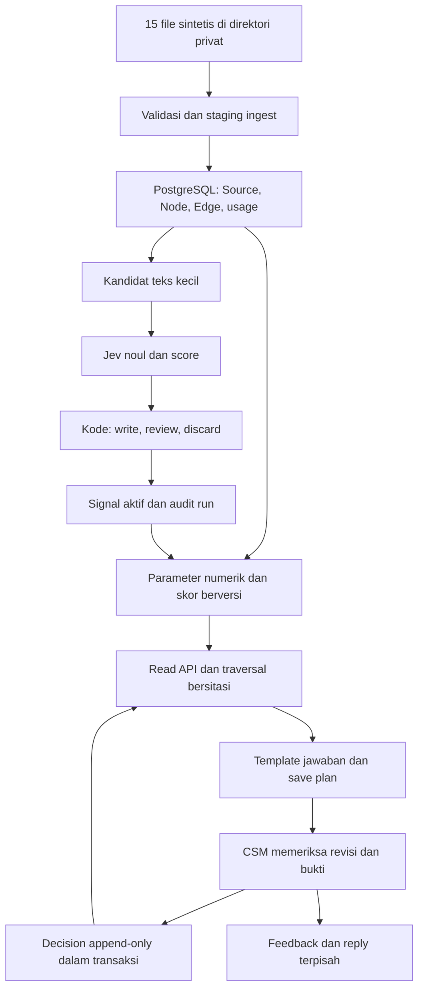

# 11 — Rencana backend Tessera

> Disusun 9 Oktober 2026 dari dokumen proyek, kode checkout, dan pemeriksaan 15 file dataset lokal. Rencana implementasi; bukan klaim backend selesai. Task dan bukti eksekusi: [12-BACKEND-TASKS.md](12-BACKEND-TASKS.md). Target pertama user: 9 Oktober 22.00; deadline resmi belum terkonfirmasi.

## 1. Hasil yang dituju dan kondisi awal

Backend selesai bila dataset KasirNusa masuk PostgreSQL, 40 pelanggan memiliki parameter bersumber, pertanyaan baru membaca graph aktual, save plan menghasilkan Decision persisten, feedback dapat ditanggapi, dan alur itu berjalan pada URL deployment serta lulus pengujian organik.

Kondisi yang diperiksa pada checkout `8acdb14`:

| Bagian | Bukti saat penyusunan | Implikasi |
|---|---|---|
| Frontend | Next.js dalam `frontend/`; tiga akun seed di `src/lib/demo-data.ts` | Belum membaca 40 pelanggan KasirNusa |
| Approval | `DemoStateProvider` menyimpan array di React state | Reset ketika aplikasi dimuat ulang; belum Decision database |
| Backend | Workspace root `backend/` dibuat sebagai scaffold; belum ada API runtime, migrasi, ingest, atau driver `postgres` | BE-02 menetapkan service runtime di workspace backend |
| Dataset | 15 file data + README; hitungan baris cocok dengan dokumen 10; hash ZIP cocok | Gunakan dataset lokal, tetap gitignored |
| Infrastruktur | Docker tidak ditemukan di PATH; belum ada Dockerfile/Compose, target SSH, atau env runtime proyek | Deploy publik menunggu target VPS dan BE-14 |
| Verifikasi | Script test/build/typecheck/lint/knip ada untuk frontend | Hasil frontend tidak membuktikan backend/DB/Jev bekerja |

## 2. Dasar keputusan dan konflik dokumen

Sumber scope: [01-PRD](01-PRD.md), [09-BUILD-PLAN](09-BUILD-PLAN-KASIRNUSA.md), [10-DATA-PROFILE](10-DATA-PROFILE-KASIRNUSA.md). Aturan verifikasi: [07-RULES](07-RULES.md). UI/copy: [08-DESIGN](08-DESIGN.md), [02-AGENT](02-AGENT.md). Primitif provider: [JEV-LENS](JEV-LENS.md), [JEV-KIT](JEV-KIT.md).

Tabel berikut adalah temuan checkpoint sebelum BE-01. Dokumen 01/02/03/05/Jev Kit/profil dan referensi ADR telah diselaraskan pada BE-01; status keputusan Accepted tetap. Kontrak normatif untuk task berikutnya: [13-BACKEND-CONTRACT](13-BACKEND-CONTRACT.md). Prototype boundary dari checkpoint sebelumnya masih berada di working tree frontend; implementasi canonical backend belum dipindah/dibuat.

| Topik | Pedoman untuk build ini | Temuan/riwayat checkpoint |
|---|---|---|
| Penyimpanan | PostgreSQL, ADR-0001 Accepted | SQLite dan graph DB terpisah merupakan alternatif lama |
| Driver/auth/hosting | [ADR stack Accepted](adr/0003-stack-hosting-auth-llm.md): `postgres`, SQL, VPS Compose, sesi HMAC | ADR-0004 Proposed menyebut `pg`, Zod, auth terkelola; jangan menjadikannya keputusan Accepted |
| Generatif | Template dari query graph; tanpa LLM pada MVP | 03 §4 langkah 6, Jev Kit query-time, dan ADR parameter masih menyebut LLM historis |
| Lokasi backend | Root `backend/`; UI lama tetap di `frontend/` dan nantinya berkomunikasi via HTTP | Pemisahan workspace diusulkan user dan dicatat ADR-0005 Proposed; ADR stack Accepted yang lama masih menyebut monolith |
| ADR | Rujuk nama file lengkap | Ada dua file bernomor 0003; jangan mengandalkan nomor saja |
| Ingest | CLI operator terotorisasi, dataset di path privat | Tombol Data tidak menjadi upload 226.300 baris atau menjalankan shell dari input publik |
| Migration | CLI/release job sebelum web siap, dengan advisory lock | 03 §4c juga menyebut migrasi saat start; request publik tidak boleh menjalankan migrasi |
| Entity merge | p ≥ 0,95 dan hard identifiers tidak konflik | Ambang lama 0,90 bukan pilihan pada build ini |
| Preseden kalah harga | Decision `D-2025-02`, deal `DL-006`, akun C23 | `DL-006` bukan `decision_id`; bukan contoh churn renewal |

Struktur workspace ini mengikuti permintaan user dan dicatat pada ADR-0005 (Accepted); runtime service diimplementasikan pada BE-02 (ADR-0006), verifikasi PostgreSQL masih tertunda. Pilihan `postgres` sudah disetujui; tambahan ORM, Zod, SDK, queue, Redis, atau framework memerlukan alasan dan keputusan tersendiri.

## 3. Alur dan batas modul

Satu aplikasi Next.js dan satu PostgreSQL cukup untuk 40 pelanggan. Server Components/Route Handlers/Server Actions memanggil modul domain yang sama. UI memakai DTO dari server; tidak membawa query SQL, credential, atau response provider mentah.

| Modul yang dibuat ketika diperlukan | Tanggung jawab |
|---|---|
| `backend/src/db.ts`, `contracts.ts` | Koneksi server, transaksi, DTO dan validasi boundary |
| `backend/scripts/migrate.ts`, `backend/db/migrations/*.sql` | Urutan/checksum migration; advisory lock; fail saat versi berubah |
| `backend/scripts/ingest.ts`, `backend/src/ingest.ts` | Parser CSV/JSONL, staging, provenance, hard links, publish revision |
| `backend/src/graph.ts` | Traversal, snapshot, derivasi bersumber, paket bukti dan preseden |
| `backend/src/jev.ts`, `thresholds.ts` | Provider, cache, validasi tipe, rubric version, write/review/discard |
| `backend/src/scoring.ts` | Fungsi murni parameter → skor/level/coverage; sensitivity report |
| `backend/src/intents.ts` | Katalog intent dan query/template terikat; tidak mengeksekusi SQL dari pertanyaan |
| `backend/src/auth.ts` | Login, sesi, role, origin/CSRF dan rate limit |
| `backend/src/plans.ts`, `feedback.ts` | Revisi rencana, Decision atomik, thread feedback |
| `backend/src/api/**` | Boundary HTTP: validasi, auth, rate limit, error aman; runtime dipilih BE-02 |

## 4. Dataset, ingest, dan graph temporal

Hitungan diverifikasi ulang dari CSV/JSONL pada turn penyusunan. SHA-256 ZIP: `966AF06DD5D59A2565FD11622C28193955200DF5CF1C610246134D1214309E48`. Seluruh isi sintetis.

| Sumber | Baris | Artefak backend |
|---|---:|---|
| `crm_accounts` | 45 | 40 pelanggan + 5 prospek; prospek tetap node, tidak masuk peringkat pelanggan |
| `crm_contacts`, `contact_employment_history` | 160 / 217 | Identitas, pekerjaan saat ini/historis, champion; organisasi tanpa account ID tetap tercatat |
| `crm_deals`, `employees` | 22 / 10 | Deal, owner, pihak yang meminta/memutuskan |
| `contracts_billing`, `decision_log` | 40 / 30 | Kontrak, renewal, bayar agregat, preseden `dataset_history` |
| `interactions.jsonl` | 350 | Interaksi, rantai balasan, peserta; satu baris tanpa account ID tidak dipaksakan ke akun |
| `outlets`, `product_usage_daily` | 620 / 226.300 | Outlet dan tabel usage, bukan 226.300 node graph |
| `feature_usage_monthly` | 1.178 | Pemakaian fitur dan agregat bertanggal |
| `support_tickets` | 640 | Tiket; status roadmap dipisah dari Terbuka |
| `bugs`, `releases`, `features` | 4 / 3 / 8 | Bug/version/roadmap dan sumber derivasi |

### Pipeline ingest

1. Baca direktori yang ditentukan operator; allowlist tepat 15 file. Validasi UTF-8, header, integer/IDR, tanggal, enum, primary ID dan reference lintas file. CSV harus menangani quoted comma, quoted newline, CRLF, BOM dan escaped quote; jangan `split(',')`.
2. `--dry-run` menghasilkan jumlah valid/invalid, orphan, duplicate, dan coverage tanpa write DB/provider. Jangan mencetak isi interaksi lengkap atau credential.
3. Buat `dataset_revision` dan `ingest_run`. Simpan hash per file dan locator per record: external ID/logical record number, record hash, dan span untuk teks. Employment history memakai composite key yang mencakup contact, organisasi/account, mulai, dan jabatan.
4. Muat usage ke staging dengan streaming/COPY; raw kosong tetap NULL. Unique `(revision, tanggal, outlet_id)`. Verifikasi account outlet sesuai master sebelum publish.
5. Bangun hard links dari ID. Email historis yang tidak cocok tetap unresolved; tidak auto-merge berdasarkan nama. Join `releases.versi` dan versi usage memakai normalisasi eksplisit, tanpa mengubah nilai sumber.
6. Validasi seluruh staging, lalu publish revision secara atomik. Error fatal menahan publish sehingga ranking tidak membaca separuh ingest. Catat kegagalan dan baris bermasalah, tidak menghapus revision sebelumnya.
7. Jev berjalan sesudah sumber committed. Provider gagal tidak merusak hard graph; status enrichment `pending/failed` terlihat. Bila dataset, rubric, model dan input tidak berubah, re-ingest tidak membuat record ganda atau call provider ulang.

### Identitas dan waktu

- Node stabil memakai `(type, externalKey)`; fakta/props temporal disimpan sebagai revisi. Source records append-only; perubahan isi membuat versi baru. Edge membawa source record(s), `hard/derived`, alasan, `validFrom/validTo` bila diketahui, serta status review.
- `businessAsOf = 2026-10-01`: penggunaan memakai tanggal `< businessAsOf`; pekerjaan memakai interval `[mulai, selesai)` setelah semantik tanggal selesai dipastikan; event historis sampai batas snapshot.
- `recordedAsOf` adalah waktu database yang sedang diperiksa, terpisah dari tanggal bisnis. Import pada 9 Oktober tetap boleh menjelaskan snapshot bisnis 1 Oktober. Jangan memfilter waktu import ke 1 Oktober sehingga semua data hilang.
- Fakta master tanpa riwayat perubahan berstatus `snapshot_only`/`unknown_time`; jangan mengklaim keadaan sebelum snapshot tersebut.
- Decision aplikasi memakai `decidedAt` aktual dan referensi snapshot/graph revision yang ditinjau. Query keputusan membaca histori aplikasi sampai waktu request, walau parameter bisnis memakai 1 Oktober. Bedakan `dataset_history` dan `app_decision` dalam UI/sitasi.

### Derivasi BUG-412

Kandidat jalur: Account → Outlet offline → Usage/version 4.12 → Release → BUG-412, serta Ticket → Outlet. Nilai `versi_terdampak`, waktu rilis/bug, gejala sinkronisasi, dan kategori/deskripsi tiket harus mendukung derivasi. Versi 4.12 juga punya BUG-415: **versi saja tidak membuktikan BUG-412**. Confidence inferensi bukan keluaran Jev kecuali ada run yang mendukung. Jalur derived/review diberi label; hipotesis tidak disajikan sebagai hubungan kausal pasti.

## 5. Skema dan invariants minimum

| Tabel/logical entity | Invariant penting |
|---|---|
| `schema_migrations` | Version/checksum unik; migration tak diubah sesudah diterapkan |
| `dataset_revisions`, `ingest_runs`, `sources`, `source_records` | Published revision eksplisit; file/record hash; source immutable; re-ingest idempotent |
| `nodes`, `node_facts`, `edges`, `edge_sources` | Hard key unik; FK; interval valid; provenance bisa memuat lebih dari satu sumber |
| `usage_daily`, `feature_usage_monthly` | Unique key per revision; unit dan NULL benar; angka nonnegatif |
| `jev_runs`, `signals`, `signal_reviews` | Rubric/model/input hash; valid span; review/discard tidak menjadi signal aktif |
| `account_factors`, `score_runs` | Account/snapshot/revision/formula version; raw value, normalized value, unit, coverage, evidence, status |
| `plans`, `plan_revisions`, `decisions` | Plan revision immutable; Decision append-only; `(actor_id, idempotency_key)` unik; payload hash diperiksa |
| `feedback`, `feedback_replies` | Actor/waktu/context/FK; reply tidak memperbarui skor atau Decision |

Gunakan CHECK/FK/unique constraint, parameter binding, pool kecil, index pada endpoint edge, account/tanggal usage, source hash, dan status review. Role migrator dipisah dari role runtime. Runtime tidak mendapat UPDATE/DELETE pada Decision; perlindungan DB diuji langsung. Data sintetis di label revision, bukan disimpulkan dari nama file.

## 6. Parameter dan eksperimen scoring

Seluruh angka dihitung kode/SQL. Simpan nilai mentah terlebih dahulu; normalization/threshold harus diberi versi dan hasilnya ditinjau pada BE-08. Bobot pertama `30/25/20/15/10` adalah eksperimen. Target QA C03/C05/C01 tidak boleh dipenuhi dengan skor atau cabang khusus account ID.

| Kelompok | Pengukuran awal yang dapat diaudit |
|---|---|
| Usage 30% | `SUM(jumlah_transaksi) / distinct tanggal tercakup`; bandingkan 3 Jul–30 Sep dengan 4 Apr–2 Jul (masing-masing 90 hari); `(recent - previous)/previous` hanya bila previous > 0; coverage berdasarkan expected outlet-days |
| Service 25% | Terbuka pada snapshot, umur tiket, tiket 90 hari, rasio unresolved, prioritas dan bug; status sekarang tidak merekonstruksi status historis sebelum snapshot tanpa riwayat |
| Champion 20% | CRM champion vs kontak/riwayat kerja aktif; mismatch dan tanggal pindah; tenure decision-maker hanya jika peran terbukti |
| Promise/engagement 15% | Janji `Belum ditepati`, umur sejak keputusan, status/target fitur; hari sejak interaksi eksternal; renewal email belum punya balasan dalam dataset |
| Payment 10% | Agregat `keterlambatan_bayar_12bln`: 0, 1, 2+; tidak ada invoice aging |

**Usulan eksperimen, belum formula Accepted:** risk usage `clamp(-relativeChange, 0, 1)` hanya untuk coverage memadai; champion pindah 1, decision-maker baru terverifikasi 0,5; pembayaran `min(lateCount/2, 1)`. Service dan promise/engagement mencoba normalisasi count/age yang batasnya dicatat dalam config, tidak ditanam di prompt. Penggabungan subfaktor memakai aturan yang eksplisit supaya gejala sama tidak dijumlah berulang.

Data hilang/invalid/baseline nol menghasilkan status dan alasan, bukan nilai 0. Aturan score partial harus dipilih pada BE-08: tahan score bila faktor wajib tidak tersedia; atau laporkan score partial dengan coverage dan denominator bobot yang tersedia. Jangan membandingkan score partial dengan complete tanpa label.

Penurunan server usage outlet gagal sinkron masuk `data_quality` dan penanganan service; bagian penurunan tersebut dikeluarkan dari kontribusi usage. Simpan mapping bukti yang dikecualikan. Jika seluruh usage menjadi tidak andal, tampilkan unavailable/partial sesuai policy, bukan "usage normal". Uji pola sama pada akun selain C03/C05.

Level Low/Medium/High/Critical, cutoff, dan mapping dashboard Hijau/Kuning/Merah dicatat sebagai hipotesis berversi sebelum run. Hasil uji boleh menolak hipotesis; jangan mengubah expected result setelah melihat hasil tanpa catatan. Sensitivitas: geser satu bobot ±10 poin, renormalisasi total 100%, simpan tiga besar dan pergeseran per akun. Renewal, NPS dan IDR annual value tetap konteks; weighted value `annualValue × score / 100` bukan prediksi kerugian.

## 7. Jev, review, dan pertanyaan baru

BE-06 memverifikasi request/response API terhadap quickstart resmi dan satu health-check sebelum enrichment berbayar. `noul` menyimpan probabilitas ya; `score` menyimpan score, confidence dan distribusi. Nilai tak terdefinisi/out of range masuk error, tidak menjadi bukti aktif.

- Teks eksternal/tiket dipilih kode; satu batch pertanyaan kecil per chunk, offset terhadap teks asli. Quote harus substring pada span yang benar; jangan meminta model menciptakan kutipan.
- Ambang signal `p ≥ 0,85` write, `0,50 ≤ p < 0,85` review, sisanya discard. `score` write hanya confidence ≥0,80 dan severity ≥2; definisi lain eksplisit dalam rubrik.
- Entity merge `p ≥ 0,95`, tanpa konflik ID; `0,60 ≤ p < 0,95` review. Hard IDs menyelesaikan sebagian besar dataset; entity resolution tidak menghalangi core ingest.
- Cache berdasarkan canonical input, model string, rubric version, primitive dan chunk hash. Timeout/retry dibatasi dan dicatat; 401/403 tidak di-retry. Request count/token/cost disimpan; harga tidak tersedia berarti cost NULL, bukan nol.
- Budget guard menghitung request yang belum di-cache sebelum run. Enrichment bertahap: health-check → fixture berlabel → C01–C06 → keseluruhan. Credential/budget yang belum ada menghalangi live call, tidak diganti skor Jev rekaan.
- Eval 30 contoh berlabel per primitif yang dipakai; label disiapkan sebelum run, laporkan N, kesalahan, abstain dan actual usage. Ini eval klasifikasi, bukan kalibrasi churn.

Router mengirim katalog intent sebagai pertanyaan `noul` dalam satu request batch bila kontrak API mendukung. Hitung request dan jumlah questions secara terpisah. Pilih tertinggi p ≥0,70 dan gap ≥0,15; entitas di-resolve dari ID/nama dengan ambiguity handling. API `choice` hanya dipakai setelah terbukti tersedia dan perubahan kontrak dicatat.

Katalog awal: faktor risiko; akun terdampak bug; champion pindah; janji fitur; tiket terbuka; renewal terdekat; preseden diskon/eskalasi; mismatch dashboard; interaksi terakhir; akun pemakai fitur. Query di-bind, traversal depth ≤4, batas node/edge/result, cycle guard dan query timeout. Pertanyaan di luar katalog/entitas ambigu/bukti kurang menghasilkan abstain dengan alasan.

Setiap jawaban berisi `intent`, `status`, `businessAsOf`, `graphRevision`, `text`, `facts`, `citations`, `paths`, dan `limitations`. Rekomendasi menyebut minimal tiga **kelompok sumber** bila tersedia; tiga node dari satu file tidak cukup. Jangan memaksa pertanyaan sederhana memiliki tiga sumber. Provider mati → layanan pertanyaan menyatakan unavailable; graph/ranking tetap bisa dibaca.

## 8. Kontrak aplikasi dan write

Kontrak berikut usulan untuk BE-01; read boleh melalui server module langsung untuk Server Components.

| Boundary | Akses dan perilaku |
|---|---|
| `GET /api/health/live` | Publik, proses hidup; tidak membuka env |
| `GET /api/health/ready` | 200 bila DB/migration/published revision siap; 503 bila belum; status Jev terpisah |
| `GET /api/accounts` | Publik demo, filter/search/sort allowlist, total 40, pagination bila diperlukan |
| `GET /api/accounts/[id]` dan `/evidence` | Parameter, timeline, bounded subgraph, sitasi aman; 404 akun tak ada |
| `GET /api/data/status` | Statistik sumber/ingest/Jev, tanpa lokasi privat dan raw provider log |
| `askGraph` Server Action | Publik demo yang dibatasi laju/budget; body/question terbatas; Jev router → SQL/template |
| `login`, `logout` Server Actions | Sesi akun operator, rate limit brute force, cookie secure pada HTTPS |
| `createPlan`, `revisePlan`, `decidePlan` | requireSession/role; revisi, bukti, preseden, reason dan idempotency key |
| `submitFeedback`, `replyFeedback` | Sesi operator; actor dari server, context tervalidasi |
| Ingest/migrate CLI | Operator SSH, path tetap privat; tidak ada endpoint upload/unrestricted shell |

Error aman: validation 400, unauthenticated 401, forbidden/origin 403, unknown 404, stale plan/idempotency mismatch 409, rate limit 429, dependency unavailable 503, unexpected 500 + correlation ID. Server Action mengembalikan error typed yang setara; tidak menganggap action selalu punya HTTP status domain tersebut.

Auth: password/env tervalidasi, comparison timing-safe atas fixed-length digest, session payload version/actor/role/expiry + HMAC, verifikasi signature/expiry pada setiap write. Cookie HTTP-only, Secure pada HTTPS, SameSite=Lax; logout menghapus cookie. Actor/role tidak diterima dari field form tanpa verifikasi server. Origin/host diperiksa; kontrak trusted proxy ditetapkan agar IP/rate limit tidak dapat dipalsukan lewat `X-Forwarded-For`. Satu instance boleh limiter in-memory dengan TTL/size cap; restart reset dinyatakan dan reverse proxy memberi pembatasan tambahan.

Plan revision mengikat snapshot/formula/graph revision dan evidence hash. Draft dari template mencantumkan preseden atau "tidak ada preseden yang cukup", bukan sitasi palsu. Diskon >10% memerlukan VP Sales menurut README dataset; akun demo CSM tidak otomatis berwenang menyetujui nominal tersebut. Human review harus membedakan approval rencana dari otorisasi diskon. Penyimpangan wajib alasan dan eskalasi sesuai policy.

`decidePlan`: transaksi memeriksa existing idempotency key/payload → lock plan revision → validasi status/bukti → insert Decision + edge/source app → commit. Retry payload identik mengembalikan Decision yang sama; payload berbeda/keputusan kedua/stale revision menolak 409. Runtime dilarang update/delete Decision. Feedback/reply tidak memanggil scoring atau mengubah keputusan.

## 9. Deployment yang harus dicoba sesudah backend siap

User sudah meminta deploy dan testing. Eksekusi masih memerlukan hostname/alias SSH, user, domain/HTTPS, direktori aplikasi, serta env server. Jangan menebak tujuan dari remote GitHub atau SSH host lain. Tidak membuat akun layanan berbayar baru sebagai pengganti VPS yang belum diberikan.

**Berkas yang dibuat BE-14:** Dockerfile multi-stage Node/pnpm sesuai versi tervalidasi, `.dockerignore`, `compose.yaml` (`web`, `db`, migration/ingest job bila diperlukan), `.env.example` placeholder, dan `docs/DEPLOY.md` dengan command aktual. `output: standalone` disertai runner/static assets; tetap memakai `frontend/` sebagai build context.

**Urutan release pada VPS:**

1. SSH ke target yang diberikan; periksa OS, Docker/Compose, disk, port dan service yang ada. Pilih staging/project directory yang tidak menimpa aplikasi lain.
2. Catat Git SHA/image tag, runtime version, domain, release time. Env melalui file privat/server secret; jangan copy credential ke image atau output command.
3. Build dari lockfile yang sudah lulus test/build/typecheck/lint/knip. `.dockerignore` mengecualikan `.env`, node_modules lokal, dataset, cache dan `.git`. Database port tidak dibuka publik; volume persisten.
4. Siapkan PostgreSQL, tunggu sehat; backup bila DB sudah berisi data. Jalankan migration release job sekali, di luar request web.
5. Transfer dataset sintetis melalui SSH hanya ke direktori privat di luar web root; mount read-only ke ingest job. Dataset tidak menjadi asset publik, repository, atau isi image.
6. Dry-run → ingest → enrichment sesuai budget → scoring → reconciliation. Published revision dan 40 pelanggan harus benar sebelum readiness mengembalikan 200.
7. Jalankan web di belakang HTTPS reverse proxy yang tersedia; `Secure` cookie, origin, host dan trusted-proxy setting diuji pada URL sebenarnya. Jangan menambah proxy dependency tanpa kebutuhan/keputusan.
8. Smoke test health, ranking, detail C01/C03/C04/C05, login, plan/Decision dan feedback. Ulang request approval dengan idempotency key yang sama. Restart web dan DB secara terkontrol; data tetap ada.
9. Jalankan sesi organik §10 pada URL tersebut; simpan bukti dan temuan. Bila gagal, tag release ditahan dan perbaikan diverifikasi ulang.
10. Fallback: kembali ke image terakhir yang sesuai schema, tanpa down migration destruktif/`down -v`. Backup/restore hanya pada target yang benar-benar ditentukan, dengan bukti reconciliation sesudah restore.

Saat penyusunan, target VPS/env belum tersedia, backend/Compose belum ada. Ini blocker nyata deploy, bukan status Done. Frontend seed boleh diperiksa lokal untuk baseline, tetapi hasilnya tidak disebut deployment backend.

## 10. Pengujian otomatis dan organik

### Otomatis sebelum deploy

Jalankan test/build/typecheck/lint/knip sesuai 07; unit parser/span/threshold/formula/auth; integration dengan PostgreSQL disposable pada database test terpisah; HTTP/action tests dan data reconciliation. Test tidak boleh memakai atau menghapus DB demo/produksi. Provider responses di-mock untuk test; eval live terpisah. Design lint hanya jika 08 berubah; browser jika integrasi UI berubah.

| Gate data/domain | Expected yang harus diperiksa |
|---|---|
| Ingest | 15 file, hitungan tabel di §4, 40 pelanggan/5 prospek, 620 outlet, 226.300 usage; orphan/unknown dilaporkan |
| Re-ingest | Tidak ada duplikasi, graph revision unchanged untuk input identik, cached Jev tidak dipanggil ulang |
| Snapshot | Tidak membaca event masa depan; import Oct 9 tetap dapat membaca business snapshot Oct 1 |
| Scoring | C03 tiga besar adalah hipotesis QA 09; hasil asli dilaporkan, bukan hardcode; partial/offline tidak terhitung ganda |
| Kasus fokus | C05/C01 mismatch; K017 C01→P01; FEAT-07 terkait D-2025-11; C04 renewal 5 Nov/35 hari dari snapshot dan dua kali telat |
| Bug | C03/C05 punya jalur derived dengan dasar sinkronisasi; counterexample v4.12/BUG-415 tidak salah dilabel BUG-412 |
| Approval | Atomic, append-only, double submit/concurrent/stale revision aman; record rollback tidak terbaca; Decision committed bisa ditemukan query berikutnya |
| Feedback | Reply tersimpan; hash/isi score dan Decision tetap sama |
| Security | Write tanpa sesi/origin salah ditolak; sesi expired/tampered ditolak; invalid input, SQL injection string dan spoofed IP tidak melewati boundary |

### Organik: memakai aplikasi sebagai CSM/juri

Organik berarti operator berinteraksi dengan aplikasi yang berjalan, memilih urutan sendiri dan mengajukan parafrase baru. Tidak memanggil test fixture langsung atau menampilkan jawaban hardcode. Semua angka tetap berlabel dataset sintetis.

Minimal dua sesi: CSM/operator dan pembaca publik/juri (orang berbeda bila tersedia). Catat tester, URL, SHA, dataset revision, formula, rubric/model, businessAsOf dan waktu run. User menjalankan sesi bila tidak ada browser/tool/operator; jangan mengaku melakukan UAT manusia atas nama user.

| ID | Tugas pengguna | Bukti lulus |
|---|---|---|
| O01 | Buka URL sebagai pengunjung tanpa login | Ranking 40 pelanggan, label sintetis/snapshot; write tidak terbuka |
| O02 | Cari akun dengan ID lalu nama; filter level/sort renewal | Hasil sesuai data; prospek tidak masuk ranking pelanggan |
| O03 | Buka C05 dan telusuri gejala offline ke BUG-412 lalu C03 | Setiap edge/source dapat dibuka; derived jelas; tiga kelompok sumber untuk rekomendasi |
| O04 | Buka C01, cari champion dan komitmen fitur | K017→P01, D-2025-11→FEAT-07; periode/sumber benar |
| O05 | Tanyakan renewal terdekat tanpa menghafal kalimat contoh | C04/5 Nov 2026; nominal/hari dihitung dari snapshot yang tampil |
| O06 | Ajukan ≥5 pertanyaan baru dalam intent dan ≥3 di luar intent | Jawaban bersitasi atau abstain/unavailable; tak ada fakta rekaan |
| O07 | Minta probabilitas churn/profit promo/referral yang tak tersedia | Menjelaskan keterbatasan dataset, tidak menciptakan nominal |
| O08 | Coba approve tanpa login, lalu login dan edit draft | Akses pertama ditolak; draft terikat revision/bukti/preseden |
| O09 | Approve, klik dua kali, refresh, logout/login | Satu Decision; actor/waktu/revision tersimpan; tidak ada outreach |
| O10 | Tanyakan keputusan terbaru untuk akun yang sama | Decision aplikasi baru terlihat, dibedakan dari histori dataset |
| O11 | Dua tab meninjau revisi berbeda | Stale revision/conflicting decision ditolak dengan pesan jelas |
| O12 | Beri pendapat, balas, lalu periksa parameter/Decision | Thread persisten; skor dan Decision tidak berubah otomatis |
| O13 | Restart web dan DB secara terkontrol | Decision, thread, graph dan revision tetap ada |
| O14 | Putus akses Jev di staging, bukan mengganggu orang lain | Ranking tetap terbaca; tanya/enrichment memberi error/status jujur |
| O15 | Ulang alur di 375/768/1440 dan keyboard | Tidak overflow; drawer/focus/loading/empty/error; UI English sesuai 08 |

Simpan catatan di `docs/qa/backend-organic-YYYYMMDD.md` ketika run pertama benar-benar terjadi. Format setiap kasus: langkah/pertanyaan asli, expected, actual, PASS/FAIL/BLOCKED, source/Decision IDs, screenshot/log aman dan issue tindak lanjut. Pertanyaan/label evaluasi dikunci sebelum run model; temuan organik baru diberi versi bila dimasukkan eval berikutnya. Jangan mengisi PASS dari rencana.

**Release selesai:** seluruh Must task BE-01–BE-16 yang relevan selesai, cek otomatis hijau, tidak ada defect yang menyebabkan kehilangan data/akses write tak sah/fakta tanpa sumber, URL dapat diakses, persistence restart lulus, dan O01–O15 memiliki hasil aktual. Benchmark SalesTranscriptQA opsional terpisah; hasilnya bukan syarat mengklaim prediksi churn.
